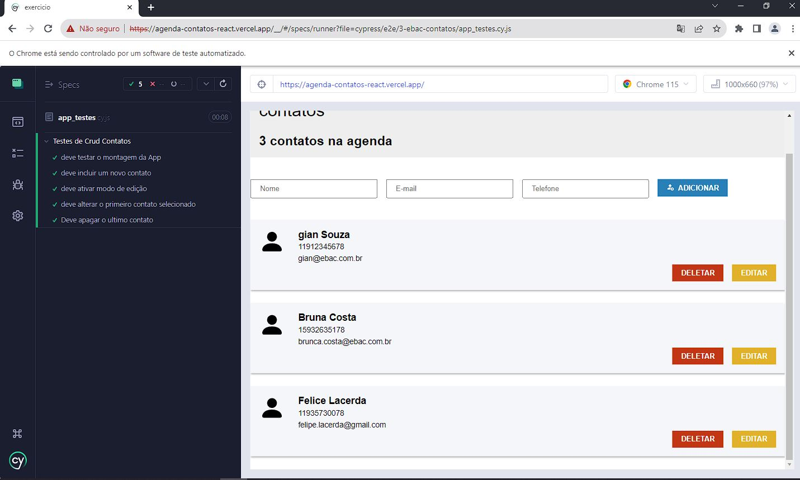

# Exercicio Cypress

Modulo N° 24 Curso Fullstack Java da EBAC

## Precissa para testar:

Foi instaladoo pacotes de NPM conforme dependencia do package.json para instalar foi executado o comando ``` npm i --save-dev ```
Apos disto executado o comando ```npm run cypress open``` para executar o Cypress

Descrição do projeto:

Criar um projeto de testes utilizando o Cypress;
• No script de testes é testado as funcionalidades de uma aplicação (página de contatos);
• Foram testadas as seguintes funcionalidades: inclusão, alteração e remoção de um contato;

O Cypress é uma ferramenta de teste de ponta a ponta (end-to-end) voltada para testes de interface do usuário em aplicativos da web. É uma estrutura de teste automatizado que permite escrever, executar e depurar testes de forma fácil e eficiente.

O Cypress é construído em JavaScript e é executado diretamente no navegador, o que o diferencia de outras ferramentas de teste. Ele oferece uma API intuitiva que permite interagir com os elementos da interface do usuário, realizar ações como clicar em botões, preencher formulários e verificar a exibição de elementos na página.

<h2>Visualização Online</h2>
<p>A landing page do projeto está disponível para visualização na Vercel. Você pode acessá-la através do seguinte link: https://agenda-contatos-react.vercel.app/

<h2>Pré-visualização</h2>




